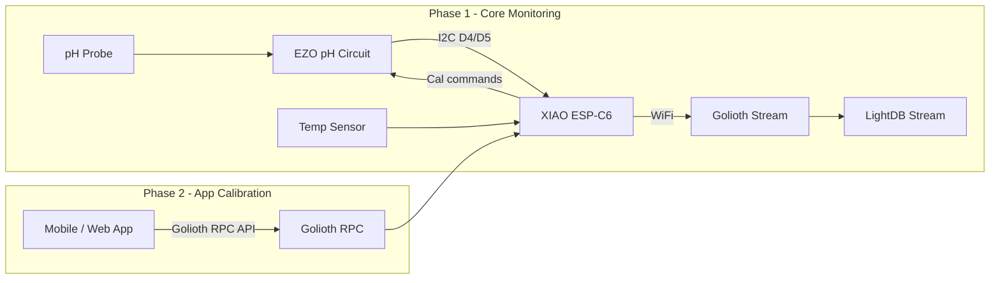
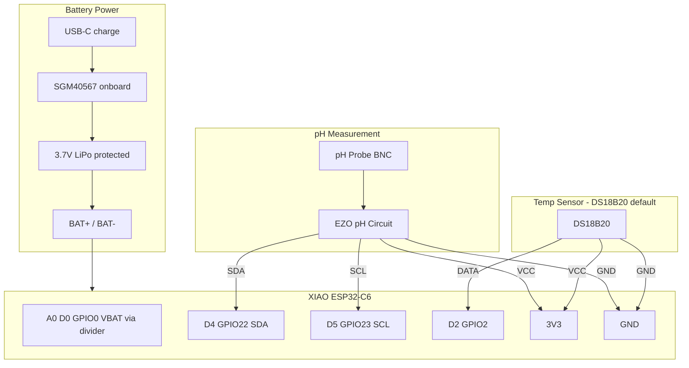

# XIAO ESP-C6 pH Monitor to Golioth

## Context

- **Target repo:** [wischmi2/xiao-espc6-ph](https://github.com/wischmi2/xiao-espc6-ph)
- **Reference project:** [xiao-espc6-water-detector](https://github.com/wischmi2/xiao-espc6-water-detector) — ESP-IDF 5.4.x + Golioth Firmware SDK v0.22.0, WiFi/credentials shell, JSON Stream → LightDB Stream pipeline
- **Sensor:** Atlas Scientific [EZO pH circuit](https://files.atlas-scientific.com/pH_EZO_Datasheet.pdf) — I2C default address **99 (0x63)**, 3.3V compatible, ASCII command protocol



---

## Hardware

### Connection diagram

Default build: **DS18B20** temp sensor + **EZO pH** on I2C, **3.7 V LiPo** on XIAO BAT pads.

```
  ┌──────────────────────────────────────────────────────────────────────────┐
  │  USB-C (optional) ──► charge ──►  SGM40567 onboard charger               │
  │                                      │                                   │
  │  3.7 V LiPo ──► BAT+ / BAT- ◄───────┘    (pads on bottom of XIAO)       │
  │  (use cell with protection PCB)                                          │
  │       │                                                                  │
  │       └──► 3V3 rail ──► EZO pH, DS18B20, sensors                        │
  └──────────────────────────────────────────────────────────────────────────┘

                         ┌─────────────────┐
                         │   pH Probe      │
                         │   (Atlas BNC)   │
                         └────────┬────────┘
                                  │ BNC
                         ┌────────▼────────┐
                         │  EZO pH Circuit │
                         │  I2C addr 0x63  │
                         └──┬──┬──┬──┬─────┘
                            │  │  │  │
           VCC ─────────────┘  │  │  └──────────── GND
           SDA ────────────────┘  └─────────────── SCL
            │                      │
            │    ┌─────────────────┴──────────────────────────────┐
            │    │           Seeed XIAO ESP32-C6                    │
            │    │                                              │
            │    │  BAT+ / BAT-  ◄── 3.7 V LiPo (battery power)   │
            │    │  USB-C        ◄── charge / bench power        │
            │    │  A0 / D0 (GPIO0) ◄── VBAT via 200k divider (optional) │
            │    │                                              │
            │    │  D4 (GPIO22) ◄── SDA ─── I2C bus ───► EZO pH  │
            │    │  D5 (GPIO23) ◄── SCL ─────────────────────────  │
            │    │  3V3         ◄── VCC (EZO + DS18B20)            │
            │    │  GND         ◄── GND (EZO + DS18B20)            │
            │    │  D2 (GPIO2)  ◄── DATA (DS18B20, 1-Wire)         │
            │    │  D6/D7       ── UART (one-time I2C mode switch)  │
            │    └──────────────────────────────────────────────────┘
            │                      ▲
            │                      │ 4.7 kΩ pull-up (DATA → 3V3)
            │               ┌──────┴──────┐
            └───────────────┤  DS18B20    │
                            │  VCC  GND   │
                            │  DATA       │
                            └─────────────┘
```

**Battery notes (XIAO ESP32-C6):**

- Solder a **3.7 V LiPo with built-in protection PCB** to **BAT+** (near D5) and **BAT-** (near D8). Do not connect a battery to the 3V3 pin.
- USB-C charges the battery via the onboard **SGM40567** (4.2 V termination). There is **no undervoltage cutoff** — use a protected cell or monitor VBAT in firmware (Seeed example: GPIO0 / A0).
- When on battery only, the **5V pin does not output** — power peripherals from **3V3** and **GND**.

**Alternative (Atlas EZO RTD):** omit DS18B20; connect RTD board to the same I2C bus (D4/D5) at its own address.



### Battery power and current estimate (1 reading / minute)

Firmware should use a **wake → measure → stream → sleep** cycle, not stay connected 24/7. Per Atlas EZO datasheet (I2C mode @ 3.3 V):

| Component | Sleep / idle | Active (reading) |
|---|---|---|
| EZO pH | **~1.0 mA** (`Sleep` command) | **~16 mA** standby during `T`/`R`; brief peaks during conversion |
| DS18B20 | **~1 µA** | **~1 mA** for ~750 ms (12-bit conversion) |
| XIAO ESP32-C6 | **~0.15–0.5 mA** deep sleep (board overhead above 15 µA chip) | **~80–120 mA** avg during WiFi connect + CoAP stream (~3–5 s) |

**Estimated duty cycle per 60 s wake cycle:**

| Phase | Duration | Est. current | Charge |
|---|---|---|---|
| ESP32 deep sleep | ~52 s | 0.2 mA | 10 mAs |
| EZO sleep (dominant idle load) | 60 s | 1.0 mA | 60 mAs |
| Wake: DS18B20 + EZO `T` + `R` | ~2 s | 20 mA | 40 mAs |
| EZO processing delays | ~1.2 s | 16 mA | 19 mAs |
| WiFi connect + Golioth stream | ~4 s | 90 mA | 360 mAs |
| **Total per minute** | 60 s | | **~490 mAs** |

**Average draw ≈ 8 mA** (typical, with deep sleep + EZO sleep + WiFi on-demand).

| Scenario | Avg current | 2000 mAh LiPo runtime |
|---|---|---|
| Optimized (fast WiFi, `L,0` LED off, cached session) | **~5–7 mA** | **12–17 days** |
| Typical (as table above) | **~8–10 mA** | **8–10 days** |
| Conservative (slow WiFi, no sleep tuning) | **~12–15 mA** | **5–7 days** |

The **EZO sleep current (~1 mA continuous)** is the largest idle contributor — roughly 60 mAs/min even when the ESP32 is deep sleeping. Disabling the EZO LED (`L,0`) saves a small amount; fully power-cycling the EZO would save more but adds probe stabilization time after each wake.

**Firmware power requirements (Phase 1):**

- Deep sleep ESP32 between readings; wake on timer (60 s default via Kconfig)
- Send `Sleep` to EZO after each reading; any I2C command wakes it for the next cycle
- Send `L,0` once at boot to disable EZO LED
- Connect WiFi only during the wake window; disconnect before sleeping
- Read VBAT on **A0 / D0 (GPIO0)** via Seeed's 200k **1:2 voltage divider** (solder mod); include `battery_v` in stream payload; deep sleep below 3.0 V

**Alternative — always-on WiFi:** modem-sleep/light-sleep keeps the Golioth link up at **~3–30 mA continuous** (~3–7 days on 2000 mAh regardless of reading rate). Not recommended for battery unless readings are very frequent.

### Wiring (XIAO ESP32-C6 ↔ EZO pH)

| EZO pH | XIAO ESP32-C6 |
|---|---|
| VCC | 3V3 |
| GND | GND |
| SDA | D4 (GPIO22) |
| SCL | D5 (GPIO23) |
| Probe | BNC to Atlas pH probe |

- Power at **3.3V** (within EZO 3.3–5V range; matches XIAO I/O).
- I2C pull-ups: XIAO and EZO boards typically include 4.7kΩ; verify if bus is unstable.
- **First-time mode switch:** EZO ships in **UART mode**. Before I2C firmware works, send `I2C,99` once over UART (D6/D7 at 9600 baud) or use Atlas Desktop. Calibration persists across mode changes.

### Temperature sensor (dedicated sensor on XIAO)

Recommended options (pick one at build time via Kconfig):

| Option | Wiring | Notes |
|---|---|---|
| **DS18B20** (recommended default) | Data → D2 (GPIO2), 3V3, GND; 4.7kΩ pull-up on data | Simple 1-Wire; widely used with Atlas pH |
| **Atlas EZO RTD** | Same I2C bus as pH (second address) | Best accuracy pairing; same EZO command protocol |

Firmware will read temperature each cycle and send `T,<temp_c>` to the EZO before `R` (read pH). Atlas default compensation is 25°C; temp is **not retained after power loss**, so firmware must set it every reading.

---

## Software architecture

Bootstrap this repo from the [water-detector](https://github.com/wischmi2/xiao-espc6-water-detector) skeleton:

| File | Change |
|---|---|
| `CMakeLists.txt` | Rename project to `xiao-espc6-ph` |
| `sdkconfig.defaults` | Same Golioth/DTLS/PSK defaults |
| `main/app_main.c` | Replace water logic with pH poll + stream |
| `main/ph_sensor.c/h` | **New** — EZO I2C driver |
| `main/temp_sensor.c/h` | **New** — DS18B20 or EZO RTD reader |
| `main/Kconfig.projbuild` | pH poll interval, I2C address, temp sensor type |
| `pipelines/json-to-lightdb.yml` | Reuse unchanged |

### EZO I2C driver (`ph_sensor.c`)

Implement the Atlas I2C transaction pattern from the datasheet:

1. **Write command** — I2C write of ASCII command string (e.g. `R`, `T,23.5`, `Cal,mid,7.00`)
2. **Processing delay** — wait before reading response:
   - Most commands: **300 ms**
   - `R` (read pH): **900 ms**
   - Calibration commands: **900 ms**
3. **Read response** — 1-byte status code then data string:
   - `1` = success, `254` = still processing (delay too short), `2` = syntax error, `255` = no data
4. **Parse** — pH returned as ASCII float (e.g. `"7.123"`), 3 decimal places

Key commands for Phase 1:

| Command | Purpose |
|---|---|
| `R` | Read current pH |
| `T,n` | Set temperature compensation (°C) |
| `Cal,?` | Query calibration point count (`?CAL,0`–`?CAL,3`) |
| `i` | Device info / firmware version |

### Golioth streaming (Phase 1)

- **Stream path:** `sensor/ph`
- **Poll interval:** **60 s** default (battery-powered; configurable via Kconfig)
- **Power mode:** deep sleep between readings; wake → measure → WiFi connect → stream → sleep
- **Heartbeat:** optional every N cycles when value unchanged (or skip if every wake is a publish)
- **Example payload:**

```json
{"ph": 7.123, "temp_c": 23.5, "battery_v": 3.85, "cal_points": 2, "heartbeat": 0}
```

### Golioth cloud setup

1. Create device in [Golioth Console](https://console.golioth.io) (e.g. `esp32-c6-ph`)
2. Deploy JSON pipeline from `pipelines/json-to-lightdb.yml`
3. Provision via serial shell: `settings set wifi/ssid`, `wifi/psk`, `golioth/psk-id`, `golioth/psk`, `reset`

---

## Calibration process (Atlas EZO pH)

Calibration is stored on the **EZO circuit** (survives power cycles and I2C mode). Firmware only sends commands; the physical procedure is the same whether triggered from serial, RPC, or Atlas Desktop.

### Prerequisites

- Atlas pH probe (soaker bottle removed, probe rinsed with distilled water)
- Fresh calibration buffers (never pour used buffer back into bottle):
  - **Mid:** pH 7.00 (required first)
  - **Low:** pH 4.00 (optional, for 2- or 3-point)
  - **High:** pH 10.00 (optional, for 2- or 3-point)
- If buffer temperature is **±2°C from 25°C**, set `T,<actual_temp>` before calibrating

### Single-point (minimum viable)

1. Rinse probe; pour fresh pH 7.00 buffer into a cup
2. Submerge probe; wait **1–2 minutes** until reading stabilizes
3. Send `Cal,mid,7.00` → expect `*OK` / response code `1`
4. Rinse probe; verify with `R` in a test sample

### Two-point (recommended)

1. **Mid first (mandatory):** pH 7.00 buffer → `Cal,mid,7.00`
2. Rinse; pH 4.00 buffer → stabilize → `Cal,low,4.00`
   - *Or* pH 10.00 → `Cal,high,10.00` for basic/alkaline range

### Three-point (best accuracy)

1. `Cal,mid,7.00`
2. `Cal,low,4.00`
3. `Cal,high,10.00`

### Verification and maintenance

| Command | Purpose |
|---|---|
| `Cal,?` | Returns `?CAL,0`–`?CAL,3` (points stored) |
| `Slope,?` | Probe health: ideal is ~100%/100% on acid/base slopes |
| `Cal,clear` | Wipe all calibration |
| `Export` / `Import` | Clone calibration string to another EZO board |

**Important rules from datasheet:**

- **Midpoint must always be calibrated first.** Re-running `Cal,mid` after a multi-point cal **clears** low/high — full recalibration required.
- Watch live readings during calibration (stream `ph` to app/console) to confirm stabilization before issuing cal commands.
- Atlas recommends recalibration roughly **once per year** with their probes; recalibrate sooner if readings drift or after long dry storage.

---

## Phase 2 (last): App-driven field calibration via Golioth

Enable Golioth **RPC** on the device so your mobile/web app can call methods through the [Golioth Device RPC API](https://docs.golioth.io/reference/device-api/rpc):

| RPC method | Params | Action |
|---|---|---|
| `ph_read` | none | Return current pH + temp + cal_points |
| `cal_status` | none | Return `Cal,?` and `Slope,?` results |
| `cal_mid` | `[7.00]` | `T,<temp>` then `Cal,mid,7.00` |
| `cal_low` | `[4.00]` | `Cal,low,4.00` |
| `cal_high` | `[10.00]` | `Cal,high,10.00` |
| `cal_clear` | none | `Cal,clear` |

**App UX flow:**

1. App shows live pH stream from LightDB Stream (already flowing from Phase 1)
2. User selects buffer type; app prompts "wait for stable reading"
3. App calls RPC (e.g. `cal_mid` with buffer value); device returns success/failure
4. App shows updated `cal_status`

**sdkconfig addition for Phase 2:** `CONFIG_GOLIOTH_RPC=y`

Serial shell can remain as a fallback for bench setup and debugging, but field calibration is intended to run through the app.

---

## Implementation phases

### Phase 1 — Core monitoring (do first)

- Initialize repo from water-detector template + Golioth submodule v0.22.0
- Implement EZO I2C driver + temp sensor driver
- Battery-aware firmware: deep sleep, EZO `Sleep`/`L,0`, 60 s wake interval, VBAT on A0
- Stream pH + temp + battery to `sensor/ph`
- README with wiring diagram (incl. LiPo), power budget, build/flash, Golioth setup, calibration procedure

### Phase 2 — App calibration (do last)

- Add Golioth RPC handlers wrapping EZO cal commands
- Document RPC method schemas for app developers
- App integration: live stream + RPC call sequence for guided calibration wizard

---

## Open hardware decision

Pick temp sensor before Phase 1 coding: **DS18B20 on D2** is the simplest starting point; switch to Atlas EZO RTD later if you want both sensors on one I2C bus.
